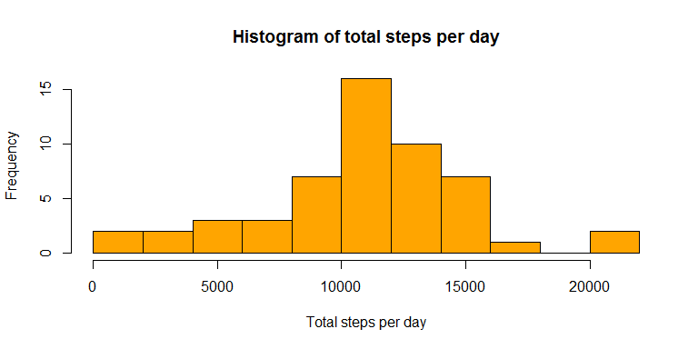

# Reproducible Research: Peer Assessment 1


## Loading and preprocessing the data

```r
# load data
activity_data <- read.csv(unz("activity.zip", filename="activity.csv"))
# convert date column to Date data type
activity_data$date <- as.Date(activity_data$date)
```
## What is mean total number of steps taken per day?


```r
steps_per_day <- with(activity_data, aggregate(steps, by=list(date), FUN="sum"))
names(steps_per_day) <- c("date", "total_steps")
hist(steps_per_day$total_steps, main="Histogram of total steps per day", xlab="Total steps per day", col="orange", breaks=10)
```

 

```r
mean_steps <- as.integer(mean(steps_per_day$total_steps, na.rm = TRUE))
median_steps <- as.integer(median(steps_per_day$total_steps, na.rm = TRUE))
```
The mean total number of steps taken per day is: **10766** and the median is: **10765**


## What is the average daily activity pattern?

```r
steps_per_interval <- aggregate(steps ~ interval, activity_data, FUN="mean", na.action = na.omit)
plot(steps_per_interval, type="l")
```

 

```r
interval_with_max_mean_steps <- steps_per_interval[which.max(steps_per_interval$steps),]$interval
max_mean_steps <- round(max(steps_per_interval$steps), 0)
```

The 5-minute interval than contains the maximum number of steps on average (**206**) accross all the days is: **835**


## Imputing missing values

```r
rows_with_na <- sum(is.na(activity_data$steps))
```


**2304** rows have NA values in the "steps" column.

We will replace all NA values in the "steps" column with the average of the corresponding interval, accross all days. These averages are already computed above, and stored in a variable.


```r
library(plyr)
```

```
## Warning: package 'plyr' was built under R version 3.1.2
```

```r
# We create a copy of the data
complete_data <-activity_data
# We replace the NA values in the "steps" column, with the average steps of the corresponding interval accross all days (already calculated and stored in variable: steps_per_interval)
# We use join in order to keep the original sorting of the data set
complete_data[is.na(complete_data$steps),]$steps <- join(complete_data, steps_per_interval, by="interval")[is.na(complete_data$steps),4]

# We create an aggregate by date, in order to plot a histogram
complete_steps_per_day <- with(complete_data, aggregate(steps, by=list(date), FUN="sum"))
names(complete_steps_per_day) <- c("date", "total_steps")
hist(complete_steps_per_day$total_steps, main="Histogram of total steps per day (NAs repleaced by interval mean steps)", xlab="Total steps per day", col="orange", breaks=10)
```

 

```r
mean_steps <- as.integer(mean(complete_steps_per_day$total_steps, na.rm = TRUE))
median_steps <- as.integer(median(complete_steps_per_day$total_steps, na.rm = TRUE))
```

The mean total number of steps taken per day after imputing missing data with the mean of the corresponding interval for all days, is: **10766** and the median is: **10766**

As we can see the impact of imputing missing data with this method, on the mean and median values, is extremelly small. Only the frequency of the column corresponding to the mean, has increased.


## Are there differences in activity patterns between weekdays and weekends?


```r
# Set the locale to English in order not to use the local name days!
Sys.setlocale("LC_TIME", "English")
```

```
## [1] "English_United States.1252"
```

```r
# We define a new column "daytype" and we initially we set all values to "weekday"
complete_data$daytype<-"weekday"
# We set "daytype" to "weekend" for those rows corresponding to Saturday or Sunday
complete_data[weekdays(complete_data$date, abbreviate=TRUE) %in% c("Sat", "Sun"), ]$daytype<-"weekend"
# We convert daytype to factor
complete_data$daytype<-as.factor(complete_data$daytype)

# We compute the average steps per interval for each daytype
complete_steps_per_interval <- with(complete_data, aggregate(steps, by=list(daytype, interval), FUN="mean"))
names(complete_steps_per_interval)<-c("daytype", "interval", "mean_steps")

# We create the plot
library(lattice)
xyplot(mean_steps ~ interval | daytype, data = complete_steps_per_interval, layout = c(1, 2), type="l", xlab="Interval", ylab="Number of steps")
```

 

From the plots we can see that there are differences in activity patterns between weekdays and weekends. Some conclusions tha we can make about the individuals that took part in the measurements are:

- They wake up later during the weekends (as most of the people)

- During the weekdays they seem to make less steps on average (Maybe most of them are doing office work and are sitting?)
